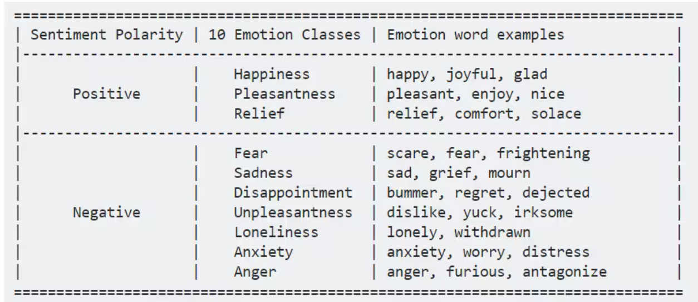

# Nature子刊 AI & Psychology 相关论文整理

## Nature Communications (s41467)
多学科开放获取期刊，涵盖了自然科学的广泛主题，包括生命科学、物理科学、化学科学等。

### Encoding of multi-modal emotional information via personalized skin-integrated wireless facial interface
通过个性化皮肤集成无线面部接口编码多模态情感信息
* [./papers/s41467-023-44673-2](./papers/s41467-023-44673-2.pdf)

#### 摘要提取
1. **研究背景和目的**：
   - 人类情感（情绪、情感、心情）被视为增强人机交互的重要参数。
   - 由于情感信息的抽象性和模糊性，准确提取并利用情感信息存在挑战。

2. **研究方法**：
   - 设计了一个**多模态人类情感识别系统**，综合利用了**言语和非言语**的表达数据。
   - 系统包含一个**个性化皮肤集成面部接口（PSiFI: personalized skin-integrated facial interface）**，具备**自供电**、**易用**、**可拉伸**、**透明**等特性。

3. **核心技术**：
   - 系统首次实现了**双向摩擦电应变和振动传感器**，可捕捉并结合言语和非言语表达。
   - 内嵌数据处理电路，实现**无线数据传输**，支持**实时情感识别**。

4. **技术优势**：
   - 借助**机器学习**，该系统能在**佩戴口罩**的情况下实时准确地进行情感识别。
   - 系统在**虚拟现实（VR）环境中**展示了一个数字化礼宾服务应用。

decoding and encoding emotional information poses significant challenges due to the inherent abstraction, complexity, and personalized nature of emotions

#### 一句话
此文章主要是基于PDMS材料制作的PSiFI工具，此工具比较轻量的收集人脸信息和声音信息，在这之后使用一维CNN处理人脸信息和使用二维CNN处理人声信息，其中的Multi-Model是数据层面上，因为可以将信息理解为视觉和听觉信息，而实际分析的时候却是分别分析的，并没有结合在一起一并分析

#### 数据和代码
<a href="https://github.com/MATTER-INTEL-LAB/PSIFI.git">https://github.com/MATTER-INTEL-LAB/PSIFI.git</a>

### Face and context integration in emotion inference is limited and variable across categories and individuals
情感推理中的⾯部和上下⽂整合是有限的，并且在不同类别和个人之间存在差异
- [./papers/s41467-024-46670-5](./papers/s41467-024-46670-5.pdf)

#### 摘要提取

1. **研究背景和目的**：
    - 能够准确推测他人的情绪状态对社交功能至关重要。
    - 虽然情绪推断可能受到**面部表情**和**情境**的影响，但关于这两类信息在情绪类别和个人之间的整合仍缺乏深入理解。

2. **研究方法**：
    - 通过**一组档案数据和五组实证数据**来分析人们如何整合情绪信息。

3. **核心发现**：
    - 发现情绪推断在多数情况下主要依赖**情境**信息，有时情境信息比面部表情更有效，而单独的面部表情信号不足以做出准确推断。
    - 人们更倾向于在日常生活中**频繁遇到的情绪类别**（如快乐）上整合面部线索。
    - 个人在情绪推断中依赖情境线索的程度具有一定的稳定性，且那些更依赖情境线索的人通常拥有更强的情境化情绪知识。

4. **结论和意义**：
    - 研究表明在情绪推断中对**情境线索和面部表情整合**的依赖存在显著差异，强调了研究这些差异性的重要性。
#### 一句话
这篇文章全是数据分析，主要是单面部信息、单情景信息和两者相结合的Bayes方法和实际情绪的相关(几乎全用Pearson相关系数进行分析)，鉴于是24年的，感觉其中对情景的强调还是比较强的，所以做情感分析的时候，如果可以在多“瞬时模态”(表情、声音、文本等即使的表达)以外加入情景信息，应该是一个比较不错的方向，但是这种情景信息对应的时间线就很长了，如何在一个“即时回复”的模型中加入一些Long内容？

#### 数据和代码
https://osf.io/7e6j5/

## Nature Human Behaviour (s41562)
专注于人类行为的跨学科研究，内容涉及心理学、认知科学、社会科学等领域。

### Multimodal mapping of the face connectome
面部连接组的多模态映射
- [./papers/s41562-019-0811-3](./papers/s41562-019-0811-3.pdf)
#### 摘要提取

1. **研究背景**：
    * 面部处理能力帮助我们辨别敌友、建立社群并理解面部肌肉变化带来的情绪含义。
    * 这种能力依赖于大脑多个区域的分布式网络。

2. **研究目的**：
    * 由于这些大脑区域之间的交互机制尚不清楚，本文旨在通过解剖与功能连接的测量和行为测试，构建面部连接组的整体模型。

3. **研究方法**：
    * 整合了网络拓扑结构和纤维组成的关键特征，提出了包含三个核心流的神经认知模型，面部处理在这些流上以平行且双向的方式进行。

4. **主要发现**：
    - 面部处理网络主要由短程纤维主导，尽管长程纤维路径也很重要。
    - 右脑侧化现象与左右脑内部及之间连接的不平衡有关。
    
5. **总结**：
    * 面部处理网络通过高度结构化的纤维通路实现动态通信，为行为和认知中的面部处理提供连贯性支持。
#### 一句话
这一篇研究的是人类神经网络，不是人工神经网络 (doge)，这里的multi-Model也是数据层面上的多模态
#### 数据和代码
https://github.com/mirrorneuronwang/HCP_face_connectome

### The representational dynamics of perceived voice emotions evolve from categories to dimensions
感知语音情感的表征动态从类别演变到维度
- [./papers/s41562-021-01073-0](./papers/s41562-021-01073-0.pdf)
#### 摘要提取
1. **研究背景**：情感科学长期以来将情绪刺激的感知分为离散类别（如愤怒的声音）和连续维度属性（如强烈、负面的声音情绪），但这两种观点的优劣仍存争议。

2. **研究目的**：对比离散类别和连续维度在情绪声音感知中的解释，分析其在大脑感知和表征结构上的表现。

3. **研究方法**：结合多模态成像（功能性磁共振成像fMRI和脑磁图MEG）和扫描后的行为评估，使用表征相似性分析（RSA）来探讨不同声音情绪的脑内表征。

4. **主要发现**：
   - 离散类别在感知阶段和早期前颞叶区域表征结构（200毫秒内）中占主导地位。
   - 连续维度则主要影响晚期的边缘系统和颞叶网络（240毫秒及500毫秒之后）。

5. **研究结论**：情绪感知可通过不同脑网络的表征动态进行解释，整合了离散类别和连续维度的视角，表明两者在不同的时间和脑区中发挥作用。

#### 一句话
这篇是在说在表征情感是使用离散的类别还是使用使用连续的类别，离散的就是直接开心，生气，等等这样的类别去描述。而连续的比如使用效价(Valence，表示情绪的正负性)和唤醒度(Arousal，表示情绪的激活水平/强度)，然后建立一个两维的表来表征。后面这种下面有一篇中的模型参考了。（这是21年的文章）

### Large-scale AI language systems display an emergent ability to reason by analogy
大规模AI语言模型展现出一种涌现的有能力理由类比
- [./papers/s41562-023-01671-0](./papers/s41562-023-01671-0.pdf)
#### 文章提取
**关键信息提取**：

1. **研究背景**：
   - 类比推理是人类智能的一个重要标志，有助于我们灵活解决新问题。类比推理的核心在于通过比较熟悉的问题来理解不熟悉的问题。
   - 人工智能是否能够具备类比推理的能力是认知科学中的一个重要问题，尤其是深度学习系统是否可以通过大量数据训练来实现这种能力。

2. **研究对象与方法**：
   - 研究测试了大型人工智能语言模型GPT-3的类比推理能力，包括一套基于文本的“Raven推理矩阵”测试（即将视觉类比问题转换为数字形式）。
   - GPT-3在测试中无需额外的特定训练来解决类比问题，这类似于人类能够在没有广泛练习的情况下解决类比问题。

3. **研究发现**：
   - 在大多数测试情境中，GPT-3的类比推理表现接近或超过了大学生，并且GPT-3的错误模式与人类相似，在更抽象和多规则的问题上表现出较高的难度。
   - 研究表明，GPT-3在生成类似人类文本的过程中获得了广泛的类比推理能力。

4. **研究的意义与局限性**：
   - 这项研究挑战了许多认知科学家和AI研究人员的观点，即深度学习系统需要任务特定的训练，并难以推广到新的问题。
   - GPT-3的局限性包括缺乏视觉处理能力、缺乏长期记忆能力，以及在物理问题上表现较差。
   - 该研究提出的问题包括GPT-3是否使用类似于人类大脑的机制进行类比推理，这些AI系统或许可以成为研究高级认知过程的“模型生物”。

5. **未来方向**：
   - 开发开放源代码的人工智能系统供认知科学家研究，从而更好地理解这些系统的优势与局限性，并确保其安全应用于社会。

#### 一句话
这篇briefing一共有一页，因为它提出“涌现”的词么？这里主要是在探索模型是否有类人类的类比推理能力，结果是类比推理还不错？

### Testing theory of mind in large language models and humans
在LLM和人类中检测心理理论
- [./papers/s41562-024-01882-z](./papers/s41562-024-01882-z.pdf)
#### 摘要提取
1. **研究主题**：探索大语言模型（LLMs），如ChatGPT和LLaMA2，在心智理论(Theory of Mind)任务中的表现，研究其与人类在理解他人心理状态上的可比性。

2. **测试内容**：进行了一系列理论推理测验，测试内容涵盖了多种认知能力，如理解错误信念、间接请求、讽刺、以及辨别社交失误（faux pas）。

3. **研究结果**：
   - GPT-4在间接请求、错误信念和误导理解方面的表现与人类相当，甚至在某些方面优于人类。
   - LLaMA2在辨别社交失误的测试中优于人类，但这种优势可能是由于其偏向于将情境解读为无知而产生的假象。
   - GPT模型在推理时较为保守，表现出一种“超保守”倾向，导致其在一些推理任务中不愿轻易得出结论。

4. **研究意义**：研究表明，LLMs的推理输出与人类推理相似，但要确保两者的比较具有实质性，需要进行系统化的测试和深入分析。
#### 一句话
这篇是在探索现有的大模型在做判断的时候“像不像人”，结果是一些方面差不多，但是一些方面因为模型本身的特质，比如“GPT-4推理时超保守”，“LLaMA2可能偏向将情景解读为无知而在辨别社交失误的测试中优于人类”？得到这些模型比较像人，但是有偏？

## Nature Neuroscience （s41593）
*Nature* 系列中神经科学领域的顶刊，涵盖神经科学各个分支的最新研究。

### Natural language instructions induce compositional generalization in networks of neurons
自然语言指令诱导神经元网络中的成分泛化
- [./papers/s41593-024-01607-5](./papers/s41593-024-01607-5.pdf)

#### 摘要提取
1. **研究背景**：
   - 人类的一项基本认知能力是根据语言指令解释并执行新任务，而无需明确的任务经验。
   - 然而，实现这一能力的神经计算机制尚不清楚。
2. **研究目的**：
   - 利用自然语言处理的进展，创建一个基于语言指令的泛化神经模型，以理解和模拟人类如何根据语言指令执行新任务。
3. **研究方法**：
   - **模型训练**：模型在一组常见的心理物理任务上进行训练，并接收由预训练语言模型嵌入的指令。
   - **零样本学习**：测试模型在未见过的任务上仅基于语言指令执行任务的能力。
   - **神经表示分析**：分析语言如何支撑感知运动表征，使相关任务的活动与指令的语义表征共享共同的几何结构。
4. **主要发现**：
   - 最佳模型在基于语言指令执行未见过的任务时，平均正确率达到83%，表现出色的零样本学习能力。
   - 语言指令支撑感知运动表征，使得相关任务的活动在几何结构上与指令的语义表征相一致，从而允许语言提示在未见过的环境中正确组合已练习的技能。
   - 模型能够根据仅有的运动反馈，生成对新任务的语言描述，并能指导合作模型执行该任务。
5. **研究结论与意义**：
   - 语言在支持灵活和泛化认知中起到了关键作用，通过构建感知运动表征的框架，语言指令能够有效地指导新任务的执行。
   - 该模型提出了若干可通过实验验证的预测，阐明了语言信息需要如何被表征，以促进人脑中灵活和泛化的认知能力。
6. **研究贡献**：
   - 提供了一个结合自然语言处理和神经网络的模型，展示了语言指令在认知泛化中的作用机制。
   - 为理解人类如何通过语言指令进行灵活任务执行提供了新的视角和理论基础。
7. **未来研究方向**：
   - 基于该模型的预测，设计实验进一步验证语言信息在灵活认知中的具体表征方式。
   - 探索如何优化语言指令的表征，以提升人工智能在复杂任务中的泛化和适应能力。

#### 一句话
这篇就是构建一个基于语言指令的泛化神经网络，探究语言如何支撑感知运动表征，从而实现灵活执行新任务的能力。研究展示了AI在零样本学习中的潜力，为理解人类认知提供了重要的理论支持，强调系统化测试在比较人类与人工智能认知能力中的重要性。

## Scientific Data (s41597)
专门用于发表数据描述的期刊，侧重于数据集的共享和重现性，促进数据驱动的科学研究。

### a uniform human multimodal dataset for emotion perception and judgments
用于情绪感知和判断的统一人类多模态数据集
- [./papers/s41597-023-02693-z](./papers/s41597-023-02693-z.pdf)
#### 摘要提取
**关键信息提取**
1. **研究背景**：
   - 面部情绪感知是人类社交互动的关键环节，但以往的研究大多集中在单一模式和面部感知的特定方面。
2. **研究目的**：
   - 提供一个全面的多模态数据集，用于研究面部情绪感知和判断，弥补人类神经成像与神经生理学文献间的研究空白。
3. **数据集组成**：
   - **EEG数据**(Electroencephalography，脑电图)：来自97位典型神经参与者的8个实验。涉及8项不同实验。此数据集包含的关键特征之一是晚期正电位（LPP），它反映出对面部表情（如表情模糊或选择困难时）的情绪判断，尤其是对模糊性表情的反应。

   - **fMRI数据**(functional Magnetic Resonance Imaging，功能性磁共振成像)：来自19位典型神经参与者。主要用于识别大脑在面部情绪（例如恐惧和快乐）判断过程中的特定区域激活。典型结果包括左侧杏仁核的激活（与恐惧/快乐情绪强度相关）及右侧杏仁核和前额叶皮层（dmPFC和vmPFC）对模糊情绪刺激的响应。

   - **单神经元数据**：来自16位神经外科患者，共22次实验。记录的数据揭示了杏仁核内神经元对面部情绪（恐惧/快乐强度）和类别模糊性的编码模式，以及在模糊性处理中前额叶皮层神经元的作用。

   - **眼动追踪数据**：来自24位典型神经参与者。收集了参与者在不同任务条件（例如，表情模糊程度或面部大小变化）下的注视数据。此外，还定义了面部的兴趣区域（ROIs），以便更精细地分析参与者的注视模式。

   - **行为和眼动追踪数据**：来自18位自闭症谱系障碍（ASD）患者及15位匹配的对照组。数据分析显示ASD患者在情绪判断上的特异性降低。尽管注视模式与对照组相似，ASD患者在情绪判断期间的瞳孔震荡较少，反映出在情绪识别上的差异。

   - **行为数据**：来自3位具有双侧杏仁核损伤的罕见患者。结果显示这些患者对恐惧情绪的行为敏感度有所增加，这与已有的杏仁核损伤研究一致，揭示出其在情绪识别和判断中的关键作用。

4. **实验任务一致性**：
   - 所有模式的参与者执行相同的任务，保证了跨模态的可比性和一致性。

5. **研究意义**：
   - 该多模态数据集为面部情绪感知提供了全面的探索，强调了整合多种模态以获得对这一复杂认知过程的全面理解的重要性。
   - 有助于神经精神病学人群的研究，并为人类神经成像与神经生理学研究提供了一个重要的连接桥梁。

6. **应用前景**：
   - 该数据集可以用于多模态情绪感知的深入研究，特别是跨神经成像和神经生理学领域的对比研究。
   - 提供基础资源，促进对自闭症谱系障碍及其他神经精神病学人群的理解。

## Scientific Reports （s41598）
**：开放获取的多学科期刊，涵盖了广泛的科学领域，注重数据丰富、方法创新的研究论文。

### Multi‑class sentiment analysis of urdu text using multilingual BERT
使用多语言BERT对urdu文本做多类别情感分析
- [./papers/s41598-022-09381-9](./papers/s41598-022-09381-9.pdf)
#### 摘要提取
1. **研究背景与重要性**：
   - 情感分析是理解公众观点的关键任务，目前大部分研究基于英文，而对于低资源语言（如乌尔都语）的研究相对有限。

2. **数据集介绍**：
   - 本研究引入了一个新的多类别乌尔都语情感分析数据集，数据来自不同领域（食品和饮料、电影和戏剧、软件和应用程序、政治和体育）。
   - 数据集包含9312条用户评论，由人工专家注释为三类情绪：正面、负面和中性。

3. **研究目标**：
   - 该研究旨在创建一个乌尔都语情感分析的数据集并设定基准结果，评估多种机器学习和深度学习模型的表现。

4. **方法**：
   - 使用了规则、机器学习（SVM、NB、Adaboost、MLP、LR和RF）和深度学习（CNN-1D、LSTM、Bi-LSTM、GRU和Bi-GRU）模型。
   - 微调了多语言BERT（mBERT）以适应乌尔都语情感分析，并采用四种文本表示方法：词n-gram、字符n-gram、预训练fastText和BERT词嵌入。

5. **结果**：
   - mBERT模型结合BERT预训练词嵌入在情感分类任务上表现优异，超过了其他深度学习、机器学习和规则分类器，获得了81.49%的F1分数。

6. **研究意义**：
   - 该研究为乌尔都语情感分析提供了高质量的数据集，并展示了多语言BERT在低资源语言情感分析任务中的有效性。

#### 一句话
数据集“新颖”，选用urdu一个`较小众`(可能只是我知道)的语言，对将近一千条评论分三类（积极、中立、消极），做的是`sentiment`分析，使用了超多方法来做分析，最后发现多语言BERT在其中效果最好(个人感觉，翻译本身就是一个广义的双射，所以如果在其他语言的数据集训练的时候已经有类似的文本，其实确实挺“作弊”的doge)

### Classification of emotional states via transdermal cardiovascular spatiotemporal facial patterns using multispectral face videos
使用多光谱面部视频通过透皮心血管时空面部模式对情绪状态进行分类
- [./papers/s41598-022-14808-4](./papers/s41598-022-14808-4.pdf)
#### 摘要提取
**关键信息提取**

1. **研究目的**：
   - 提出了一种通过多光谱面部视频远程评估情绪状态的新方法，基于独特的经皮、心血管和时空面部模式来识别情绪状态。

2. **技术方法**：
   - 该方法不依赖于传统面部表情，而是通过不同波长（可见光、近红外、长波红外）探测自主神经系统活动的面部空间和时间分布特征（如血流、血红蛋白浓度和温度）。
   - 110名参与者观看了150段情绪引发视频并报告了情绪体验，同时用三台摄像机记录多波长面部视频。

3. **数据处理与分类**：
   - 从多光谱视频中提取的时空特征输入机器学习模型，用于情绪状态分类，包括愉悦、厌恶、恐惧、性唤起和无情绪等状态。
   - 模型的分类效果良好，平均ROC AUC分数为0.75，并进行了特征重要性分析，以考察不同情绪状态下的面部变化模式。

4. **研究发现与优势**：
   - 发现了与不同情绪状态相关的时空模式。
   - 该方法相比于现有情绪检测方法的优势在于它能够提供更丰富的情绪相关生理特征信息，并在情绪分类和识别上具有较高的准确性和细致的分析能力。

#### 一句话
使用的feature不再是表面的图片，而是使用不同波长(可见光、近红外、长波红外)探测自主神经系统活动的面部空间和时间分布特征(血流、血红蛋白浓度、温度等)，感觉这种特征还是很有竞争力的，而且从个人主观上也会觉得像是血流温度这之类的会和人的情绪有较大的关系

### Pet dog facial expression recognition based on convolutional neural network and improved whale optimization algorithm
基于卷积神经网络和改进Whale优化算法的宠物狗面部表情识别
- [./papers/s41598-023-30442-0](./papers/s41598-023-30442-0.pdf)
#### 摘要提取
1. **研究背景**：
   - 识别宠物狗的面部表情有助于促进人与宠物狗之间的和谐相处（hahaha，这个角度好新奇

2. **研究方法**：
   - 使用卷积神经网络（CNN）进行狗面部表情识别，但传统CNN的参数设置可能导致学习速度慢、易陷入局部最优等问题。
   - 本研究提出了一种基于改进鲸鱼优化算法（IWOA）的CNN模型（IWOA–CNN）来优化模型性能。

3. **技术改进**：
   - 应用了Dlib工具包的专用面部检测器来识别面部区域，并通过数据增强构建表情数据集。
   - 引入随机dropout层和L2正则化以减少网络参数传输，避免过拟合。
   - 使用IWOA优化dropout层的保持概率、L2正则化参数λ以及梯度下降优化器的动态学习率。

4. **实验结果**：
   - 与支持向量机（SVM）、LeNet-5等分类器的对比实验表明，IWOA–CNN在面部表情识别方面效果更佳，证明了群体智能算法在模型参数优化中的有效性。

#### 一句话
研究内容有意思，研究的表情是狗狗的，而不是人的。参考鲸鱼优化算法(<a href="https://blog.csdn.net/hba646333407/article/details/104866241">WOA还可以参考这里</a>)来优化CNN中的多个参数，如随机dropout层的保持概率，L2正则化参数\lambda，以及动态学习率的初始值和衰减等

### Predicting and understanding human action decisions during skillful joint‑action using supervised machine learning and explainable‑AI
使用监督机器学习和可解释人工智能来预测和理解熟练联合行动期间的人类行动决策
- [./papers/s41598-023-31807-1](./papers/s41598-023-31807-1.pdf)

#### 摘要提取
1. **研究目的**：
   - 探讨监督机器学习（SML）和可解释AI在多主体任务中的人类决策建模和理解中的应用。

2. **方法**：
   - 使用长短期记忆（LSTM）网络预测专家和新手在多主体放牧任务中的目标选择决策。
   - 通过SHapley Additive explanation（SHAP）作为可解释AI技术，分析不同信息特征对模型预测的影响。

3. **主要发现**：
   - LSTM模型能够准确预测专家和新手的目标选择决策，并可提前在参与者意识到决策意图前进行预测。
   - 模型具有专业性，训练专家数据的模型无法准确预测新手的决策，反之亦然。
   - SHAP分析显示，专家比新手更依赖于目标方向和其他参与者位置的信息。

4. **研究意义**：
   - 讨论了SML和可解释AI在研究和理解人类决策过程中的假设及影响。

#### 一句话
本篇论文使用监督机器学习和可解释人工智能技术探究了在多主体任务中，专家与新手在选择目标决策上的差异及其背后的信息加工过程。使用可解释人工智能技术SHAP分析了影响专家和新手决策的关键信息特征，揭示出专家更依赖于目标朝向和位置信息以及合作方的位置来做出决策，而新手则更多地依据自身与目标之间的距离和运动方向来决定行动。

### Speech emotion classification using attention based network and regularized feature selection
使用基于注意力的网络和正则化特征选择进行语音情感分类
- [./papers/s41598-023-38868-2](./papers/s41598-023-38868-2.pdf)
#### 摘要提取
1. **研究目的**：
   - 研究并改进从语音中分类情感的准确性，以提升人机交互（HCI）和情感计算领域的应用效果。

2. **方法**：
   - 提出一种基于注意力机制的网络，结合预训练卷积神经网络（CNN）和正则化邻域成分分析（RNCA）特征选择方法，以提高语音情感分类的性能。
   - 在TESS（Toronto English Speech Sentence）公开数据集上进行实验，使用支持向量机（SVM）、多层感知器（MLP）和随机森林（RF）三种分类器进行测试。

3. **主要发现**：
   - 所提模型（Attention-based DCNN+RNCA+RF）在分类准确性上达到了97.8%，相较于其他先进的语音情感分类方法提高了3.27%的性能。
   - 实验显示注意力机制和特征选择在分类情感时与人类行为模式一致性良好。

4. **研究意义**：
   - 证明了基于注意力的网络和特征选择方法在情感识别中的有效性，为提升多语言背景下的语音情感分类提供了潜在解决方案。
#### 一句话
提出了一种基于注意力机制和正则化特征选择的语音情感分类模型，并通过实验证明了其优越性。此外，本文还介绍了特征选择的重要性，并说明了如何利用特征选择算法来降低模型复杂度并提高模型效率。

如果再有语气就好了？(<a href="https://pdf.hanspub.org/CSA20201200000_34779730.pdf">语气语音的一个小参考</a>)

### Sentence‑level sentiment analysis based on supervised gradual machine learning
基于监督渐进ML的句子级情感分析
- [./papers/s41598-023-41485-8](./papers/s41598-023-41485-8.pdf)
#### 摘要提取

1. **研究目的**：
   - 实现句子级情感分析（SLSA），即识别给定句子的整体情感倾向，克服深度学习模型在独立同分布假设（i.i.d.）下的局限性，提升其在实际数据分布差异条件下的表现。

2. **方法**：
   - 提出了一种基于非独立同分布（non-i.i.d.）的逐步机器学习（GML）方法用于句子级情感分析。
   - 使用带标记的样本进行监督的深度特征提取，并构建一个因子图以实现逐步知识传递。
   - 应用极性分类器检测邻近样本间的极性相似性，并通过二元语义网络提取任意实例间的隐含极性关系。

3. **主要发现**：
   - 在多个基准数据集上，所提方法达到了最先进的性能，比纯深度神经网络（DNN）解决方案表现更优。

4. **研究意义**：
   - 证明了通过深度神经网络进行特征提取，并结合GML逐步知识传递的方式，可以显著提升句子级情感分析的准确性，适应现实中不同数据分布的情境。

#### 一句话
基于监督式渐进机器学习（Supervised Gradual Machine Learning）（加入情感注意力层和语义深层网络）的句子情感分析方法，利用有标签的数据进行训练，并通过知识传递逐步标记无标签数据，以提高模型的性能。与传统的深度学习模型相比，该方法能够更好地适应真实场景中的分布不一致情况。

### Amharic political sentiment analysis using deep learning approaches
使用深度学习方法进行Amharic政治情绪分析
- [./papers/s41598-023-45137-9](./papers/s41598-023-45137-9.pdf)
#### 摘要提取

1. **研究目的**：
   - 针对阿姆哈拉语的政治情感分析，研究从埃塞俄比亚社交媒体上提取的政治句子情感分类问题。

2. **方法**：
   - 采用深度学习方法，包括卷积神经网络（CNN）、双向长短期记忆网络（Bi-LSTM）以及结合CNN和Bi-LSTM的混合模型进行情感分析。
   - 混合模型CNN-Bi-LSTM表现最佳，分类准确率达到91.60%。

3. **主要发现**：
   - 尽管取得了较高的准确率，但仍存在数据集多样性不足、识别讽刺与隐喻情感等挑战。

4. **研究意义**：
   - 强调从二分类情感分析向多分类分析的转变，以实现更细化的情感理解。
   - 指出构建标准化的阿姆哈拉语情感分析语料库的必要性，该语料库不仅适用于政治领域，也适用于农业、工业、旅游、体育、娱乐和满意度分析等领域。
   - 阐明了未来研究在阿姆哈拉语讽刺性评论分析方面的潜力。

#### 一句话
该研究使用了深度学习模型来进行阿姆哈拉语情感分类。在选择深度学习模型时，考虑特征提取能力、长短期依赖关系的保留、梯度消失问题的缓解、对不同语言环境的理解能力以及参数较少和收敛速度快等特点。使用的模型包括CNN， Bi-LSTM，GRU等，并提出了混合CNN-Bi-LSTM模型来进一步提高分类性能。

### Speech emotion analysis using CNN and gamma classifier‑based error correcting output codes (ECOC)
使用卷积神经网络 (CNN) 和基于gamma分类器的纠错输出代码进行语音情感分析
- [./papers/s41598-023-47118-4](./papers/s41598-023-47118-4.pdf)
#### 摘要提取
1. **研究背景与动机**：
   - 语音情感分析（Speech Emotion Analysis, SEA）是人机交互领域内推动人工智能发展的关键需求之一。其应用广泛，包括在线支持、测谎系统、客户反馈分析等，表明了其重要的现实应用价值。然而，现有技术在语音情感识别方面仍存在不足，推动研究进一步提升准确性和效率。

2. **研究创新点**：
   - 提出了新方法，通过结合**光谱-时间调制（STM）和熵特征**描述语音特征，采用卷积神经网络（CNN）进行特征降维与提取，从而捕捉信号特征。
   - 最后，通过**伽马分类器（Gamma Classifier, GC）与错误纠正输出编码（Error-Correcting Output Codes, ECOC）**组合来实现情感分类，这种方法在分类准确性上有所改进。

3. **方法结构**：
   - 方法包含预处理、特征描述、特征提取和分类等步骤，分阶段完成特征处理和分类，尤其关注于特征降维和精确分类。

4. **实验验证与数据集**：
   - 使用Berlin和ShEMO两个数据集进行实验验证。
   - 结果显示，该方法在Berlin和ShEMO数据集上的平均准确率分别为93.33%和85.73%，比现有方法提高了至少6.67%。

5. **研究贡献与成果**：
   - 本研究在现有语音情感分析技术基础上取得了显著提升，展示了STM和熵特征组合与GC+ECOC分类策略的有效性，证明了新方法在语音情感分析中的应用潜力，为未来语音情感识别方法优化提供了可借鉴的思路。

#### 一句话
使用了`声谱时变调制（STM）和熵特征`的组合来描述语音信号的情感特征。接着，利用卷积神经网络（CNN）对这些特征进行降维和提取，并最终采用基于伽马分类器（GC）和错误纠正输出码（ECOC）的分类模型来进行情感分类。

### Verbal lie detection using Large Language Models
使用LLMs做口头谎言检测
- [./papers/s41598-023-50214-0](./papers/s41598-023-50214-0.pdf)

#### 摘要提取
1. **研究背景与问题**：
   - 人类在直觉判断中的欺骗识别准确性不超过随机水平，为此，研究者开发了多种基于机器学习和Transformer模型的自动化语言欺骗检测技术。本研究是**首次探索大型语言模型（LLM），特别是FLAN-T5模型（小和基础尺寸）在语言欺骗检测任务中的表现**。
2. **研究方法与实验设计**：
   - 使用三个英文数据集（涵盖个人意见、自传性记忆和未来意图）进行实验。首先进行**文体分析**以描述三个数据集的语言差异，随后对小尺寸和基础尺寸的FLAN-T5模型在三个情境下进行了**10折交叉验证**测试：
     1. 训练和测试集来自同一数据集。
     2. 训练集来自两个数据集，测试集来自第三个数据集。
     3. 训练和测试集来自所有三个数据集。
3. **关键结果与发现**：
   - 在情境1和情境3中达到了**当前最优的结果**，超越了之前的基准水平。
   - 模型性能与模型大小相关，较大的模型表现更优。
4. **解释性分析与语言特征**：
   - 通过文体分析探讨了模型的解释性，发现与**认知负荷框架**相关的语言特征可能影响模型的预测结果。
5. **研究贡献**：
   - 本研究展示了FLAN-T5模型在语言欺骗检测中的潜力，并通过语言特征的分析提升了模型解释性，揭示了特定语言特征与欺骗检测之间的联系，为未来基于LLM的欺骗检测研究提供了新的方向。

#### 一句话
人类中判断言辞真假的准确率无法超过随机猜测水平，此工作使用FLAN-T5(小规模和基础规模)进行欺骗分类的研究，使用三个数据集，其中训练集和测试集来自相同数据集的训练效果比较好——说明三个数据集之间还是有差异的

### A pilot study of measuring emotional response and perception of LLM‑generated questionnaire and human‑generated questionnaires
测量LLM生成的问卷和人工生成的问卷的情绪反应和感知的试点研究
- [./papers/s41598-024-53255-1](./papers/s41598-024-53255-1.pdf)
#### 摘要提取

1. **研究背景与目的**：
   - 随着ChatGPT的出现，自然语言处理技术和AI聊天机器人在各领域引发广泛讨论和应用。本研究试图**探讨ChatGPT在用户体验中的影响**，通过两种问卷（分别由ChatGPT生成和人工生成）以及情绪检测模型进行评估。

2. **实验设计与数据收集**：
   - 参与者共14人（7男7女），年龄在18至35岁之间。收集到8672个与ChatGPT相关的数据点和8797个与人工生成问卷相关的数据点，采用**方差分析（ANOVA）**进行数据分析。

3. **关键结果**：
   - ChatGPT生成的问卷**提高了参与者的幸福感，减少了悲伤感**。
   - 未观察到显著的性别差异，但在特定情绪方面存在差异。

4. **局限性与未来研究**：
   - 样本量较小、年龄范围窄，以及潜在的文化影响限制了结果的广泛适用性。
   - 建议未来研究**探索其他语言模型或聊天机器人对不同年龄组情绪的影响**，特别是老年人和青少年。

5. **研究贡献**：
   - 本研究是**评估用户对ChatGPT生成内容感知的先驱之一**，结果表明ChatGPT在问卷生成方面得到了积极评价，并在提高情绪体验方面表现有效。

#### 一句话
这里使用人工生成的问卷和GPT生成的问卷对测试者情感体验上的影响("What is your gender"(human-mede) vs. "With respect, may I know your grnder"(GPT-generated))，使用情绪检测模型进行数据分析，发现GPT可以提高参与者的幸福感和降低其悲伤感。

### Hierarchical graph contrastive learning of local and global presentation for multimodal sentiment analysis
用于多模态情感分析的局部和全局表示的分层图对比学习
- [./papers/s41598-024-54872-6](./papers/s41598-024-54872-6.pdf)

#### 摘要提取
1. **研究背景与目的**：
   - 多模态情感分析（MSA）通过声学、视觉和文本线索对情感进行回归或分类。然而，大多数现有研究关注单一话语的多模态信息表达能力，而忽略了数据集的**全局共现特征**。
   - 本研究提出了一种**层次图对比学习框架**，旨在探索单一话语的局部和全局表示，以更好地提取多模态情感并分析复杂关系。

2. **方法概述**：
   - 针对每种模态，提取包含全局共现特征的**离散嵌入表示**。
   - 对每个话语构建两个图：**局部图**和**全局图**，分别对应不同层次的情感含义。
   - 采用两种图对比学习策略，通过图增强探索不同的潜在表示。
   - 设计跨层对比学习，以学习复杂关系的局部和全局潜在表示。

3. **研究创新**：
   - 首次在MSA中引入**层次图对比学习框架**，通过多层次图结构更准确地表达和学习单一话语的多模态信息和情感特征。

#### 一句话
新的多模态情感分析方法——层次图对比学习(HGCL-LG)，探索单个话语中局部和全局表示之间的关系，利用图增强策略进行跨层比较学习，以提取复杂的关系信息。该方法使用离散变分自编码器（dVAE）将不同样本映射到共同的嵌入空间，并在此基础上构建本地图和全球图，采用三种比较学习方法：本地图对比学习、全球化对比学习和跨层图对比学习，以充分学习情感特征在局部信息和全局信息以及两者之间复杂关系中的表现。

### Sentiment analysis of video danmakus based on MIBE‑RoBERTa‑FF‑BiLSTM
基于MIBE‑RoBERTa‑FF‑BiLSTM做弹幕情感分析
- [./papers/s41598-024-56518-z](./papers/s41598-024-56518-z.pdf)
#### 摘要提取

1. **研究背景与目的**：
   - **Danmaku**（视频弹幕）是用户生成的评论，显示在视频上，提供观众与视频内容的实时互动。Danmaku的情感倾向可以反映观众对视频段落的态度和意见，帮助视频平台优化内容推荐并评估用户的异常情绪水平。
   - 现有情感分析方法在Danmaku领域的**转移能力**、**文本分割精度**、**情感标注一致性**以及**语义特征提取**方面存在问题，本研究提出了一种基于**MIBE-RoBERTa-FF-BiLSTM**的视频Danmaku情感分析方法。

2. **方法概述**：
   - **数据集**：构建了“Bilibili必看列表和Top视频Danmaku情感数据集”，包括18个主题下的10,000条正负情感Danmaku文本。
   - **新词识别算法**：基于互信息（MI, Mutual Information）和分支熵（BE, Binary Entropy）的算法，发现2610个不规则的网络流行新词，形成领域词汇库。
   - **情感标注**：采用**马斯洛需求层次理论**指导情感一致性标注。
   - **模型构建**：将领域词汇库集成到RoBERTa-FF-BiLSTM模型的特征融合层中，学习Danmaku文本的词信息、字符信息和上下文信息，并进行情感分类。

3. **实验结果与创新**：
   - 提出的模型在视频Danmaku文本情感分类任务中，**F1值为94.06%**，在准确性和鲁棒性上均优于其他主流模型。
   - **创新点**：结合领域词汇库和RoBERTa-FF-BiLSTM模型，提升了Danmaku情感分类的性能。

4. **局限性**：
旨在解决视频弹幕情感分析中传统方法在领域词汇量、语义特征提取等方面的不足，通过构建“哔哩哔哩必看榜单和热门视频弹幕情感数据集”，使用互信息和分支熵算法发现不规则网络流行新词，并应用马斯洛需求层次理论指导情感标注。将自定义领域词典与RoBERTa-FF-BiLSTM模型融合，充分学习弹幕文本的语义特征和上下文信息，提高情感分类准确率和鲁棒性。
   - 领域词汇库的构建仍需人工参与和审核。
   - 忽略了Danmaku视频内容的语义信息和正向案例的偏好。

#### 一句话
旨在解决视频弹幕情感分析中传统方法在领域词汇量、语义特征提取等方面的不足，通过构建“哔哩哔哩必看榜单和热门视频弹幕情感数据集”，使用互信息(MI)和分支熵算法(BE)发现不规则网络流行新词，并应用马斯洛需求层次理论指导情感标注。将自定义领域词典与RoBERTa-FF-BiLSTM模型融合，充分学习弹幕文本的语义特征和上下文信息，提高情感分类准确率和鲁棒性。
#### 进阶：结合弹幕同时的视频内容做多模态的分析

### Predicting multi‑label emojis, emotions, and sentiments in code‑mixed texts using an emojifying sentiments framework
使用表情符号情感框架预测代码混合文本中的多标签表情符号、情绪和情感

- [./papers/s41598-024-58944-5](./papers/s41598-024-58944-5.pdf)

#### 摘要提取
1. **研究背景与目的**：
   - 随着社交媒体的普及，表情符号（emoji）和代码混合语言（如英语-印地语代码混合）在在线交流中变得至关重要。选择合适的表情符号来匹配特定的情感或情绪是一项挑战。
   - 本文提出了一项新任务：预测英语-印地语代码混合句子中的多标签表情符号、情感和情绪，并提出了一个新的数据集 **SENTIMOJI**，该数据集扩展了SemEval 2020 Task 9 SentiMix数据集。

2. **方法概述**：
   - 该方法基于情感、情绪与表情符号之间的关系，构建了一个端到端框架来解决这一任务。
   - 在变换器编码器（transformer encoder）中，采用了简单的线性变换替代了自注意力子层，并使用RMS层规范化代替传统的层规范化。
   - 采用了Gated Linear Unit（GLU）和全连接层来预测表情符号，并识别推文的情感和情绪。

3. **实验结果与创新**：
   - 在 **SENTIMOJI** 数据集上的实验结果表明，提出的多任务框架优于单任务框架。
   - 结果还表明，表情符号与情感和情绪密切相关，识别情感和情绪有助于准确预测最合适的表情符号。

4. **贡献与应用**：
   - 本研究为自然语言处理领域作出了贡献，尤其是在代码混合语言中的情感分析和情绪识别工具的开发上。
   - 提供的数据集和代码将在[链接](https://www.iitp.ac.in/~ai-nlp-ml/resources.html#SENTIMOJI)上公开，便于研究人员使用和进一步探索。

#### 一句话
引入一种多标签表情符号、情感和情绪预测框架，用于处理混合语言文本中的社交媒体帖子，利用情感、情绪和emoji之间的密切关系，使用RMS层归一化等对F-Net进行增强。提出的多任务框架优于单任务框架，且表情与情感和情绪之间存在强关联，可以准确地预测最合适的表情符号

任务新颖：在混杂文本中预测多个表情符号，并识别用户的情感和情绪

### A multimodal approach to cross‑lingual sentiment analysis with ensemble of transformer and LLM
结合 Transformer 和 LLM 进行跨语言情感分析的多模态方法
- [./papers/s41598-024-60210-7](./papers/s41598-024-60210-7.pdf)
#### 摘要提取

1. **研究背景与目的**：
   - 情感分析是自然语言处理中的一项重要任务，旨在识别文本的情感极性（正面、负面或中性）。
   - 随着社交媒体和互联网的增长，情感分析在市场营销、政治和客户服务等多个领域变得越来越重要。
   - 处理外语情感分析时，尤其是缺乏标注数据时，情感分析变得具有挑战性。
   - 本研究提出了一种集成模型，结合了变换器（transformer）和大型语言模型（LLM），通过将外语翻译成英语来进行情感分析。

2. **方法概述**：
   - 研究使用了四种语言：阿拉伯语、中文、法语和意大利语，通过两个神经机器翻译模型（LibreTranslate和Google Translate）进行翻译。
   - 然后，使用以下预训练情感分析模型的集成进行情感分析：Twitter-Roberta-Base-Sentiment-Latest、bert-base-multilingual-uncased-sentiment和OpenAI的GPT-3。

3. **实验结果与创新**：
   - 实验结果表明，使用该集成模型对翻译后的句子进行情感分析的准确率超过86%，表明通过翻译到英语，外语情感分析是可行的。
   - 提出的集成模型优于独立的预训练模型和LLM。

4. **贡献与应用**：
   - 本研究为外语情感分析提供了一种有效的方法，尤其是在缺乏标注数据的情况下。
   - 提出的集成模型能更好地进行跨语言的情感分析，对多语言社交媒体数据分析具有重要意义。

#### 一句话
探讨如何通过跨语言情感分析解决非英语语言中缺乏数据的问题，感觉比较直观，因为翻译本身就可以理解为一个广义的一一映射嘛，不过是语义层面的一一映射，毕竟两次翻译可以用来做数据增强

### Towards determining perceived audience intent for multimodal social media posts using the theory of reasoned action
使用理性行动理论确定多模式社交媒体帖子的感知受众意图
- [./papers/s41598-024-60299-w](./papers/s41598-024-60299-w.pdf)
#### 摘要提取

1. **研究背景与目的**：
   - 随着社交媒体的广泛使用，尤其在年轻人中带来了诸多负面影响，主要原因在于平台上用户难以控制所接触的多模态内容及其传达的错误信息。
   - 为了减少多模态社交媒体内容对用户心理健康的负面影响，理解内容创作者分享意图并教育用户对其意图的认知是重要的一步。
   - 本研究提出了“Intent-o-meter”，一个用于预测多模态（图像和文本）社交媒体内容中人类感知意图的模型。

2. **方法概述**：
   - Intent-o-meter 基于心理学和认知建模文献，结合视觉和文本特征，旨在改进感知意图的预测模型。
   - 该模型利用了“理性行为理论”（TRA），考虑了 (i) 创作者发布内容的态度以及 (ii) 社交规范或对多模态内容的社会认知，以判断创作者的意图。

3. **数据集与实验**：
   - 研究中引入了一个名为“Intentgram”的数据集，包括了从公开的Instagram账号抓取的5.5万条社交媒体帖子。
   - 将Intent-o-meter与四个当前的意图预测数据集（Intentonomy、MDID、MET-Meme和Intentgram）上的最先进意图预测方法进行了比较。
   - 结果显示，基于TRA的模型比仅使用视觉和文本特征的模型在意图预测准确率上提升了高达7.5%的Top-1准确率和8%的AUC。

4. **应用与用户反馈**：
   - 开发了一个网页应用，模拟社交媒体平台，并向用户展示带有意图标签的内容。
   - 调查发现，约70%的用户认为为内容打上意图标签帮助他们提高了对所浏览内容的认知，并愿意尝试基于这些标签过滤内容。
   - 研究还表明，需要更广泛的用户评估来进一步了解增加感知意图标签是否能有效减轻社交媒体的负面影响。

#### 一句话
方向很好，“解决社交媒体上虚假信息和负面情绪对用户的影响问题”，训模型(基于视觉和文本模态以及理性行动理论(TRA))用于预测社交媒体帖子的意图，并根据心理学理论将作者的态度和社会规范考虑进去。
方法也有参考价值，直接设计一个网页展示带有意图的标签来收集用户反馈，感觉之后做工作（如果有心理学相关的内容，需要收集志愿者数据）可以参考一下

### On‑device query intent prediction with lightweight LLMs to support ubiquitous conversations
使用轻量级 LLMs 进行设备上查询意图预测，以支持无处不在的对话
- [./papers/s41598-024-63380-6](./papers/s41598-024-63380-6.pdf)
#### 摘要提取
1. **研究背景与问题**：
   - 当前的对话代理（CAs）通过基于硬编码规则和固定交互流程来提供用户帮助，但这种方式限制了代理的灵活性和可扩展性。
   - 大型语言模型（LLMs）作为替代方案虽能增强对话代理，但大多数依赖云服务，无法有效保护用户隐私。
2. **研究目标与方法**：
   - 本研究旨在通过迁移学习和微调轻量级预训练LLMs来预测用户查询的意图，并实现模型的设备端部署。
   - 重点在于实现个性化、无处不在且保护隐私的用户交互场景。
3. **模型与实验**：
   - 实验结果表明，RoBERTa和XLNet在平衡模型性能与资源占用方面表现最佳，尤其适合设备端部署。
   - 微调后的轻量级LLMs在性能上可媲美ChatGPT。
4. **应用与影响**：
   - 研究探讨了该模型在隐私保护、性能与内存占用之间的平衡，并分析了对相关研究人员和实践者的潜在影响。
   - 本研究为设备端对话代理提供了LLMs的适用性见解，强调了性能和内存占用的中间平衡。

#### 一句话
这个是部署在近端的轻量预训练大模型，为设计个性、隐私保护和无处不在的对话代理提供解决方案，一些请轻量级预先训练模型可以在性能和内存占用之间找到trade-off

### An enhanced speech emotion recognition using vision transformer
使用ViT的增强语音情感识别
- [./papers/s41598-024-63776-4](./papers/s41598-024-63776-4.pdf)
#### 摘要提取
1. **研究背景与意义**：
   - 语音情感识别（SER）在人机交互系统中至关重要，使计算机能够理解并响应用户的情感。
   - 传统SER主要依赖于语音信号的声学特征，但深度学习与计算机视觉的发展使得视觉信号也能增强SER性能。

2. **研究方法**：
   - 本研究提出了一种利用轻量级视觉Transformer（ViT）模型的新方法来提升SER效果。
   - 使用ViT模型捕捉图像中的空间依赖关系和高层次特征，将mel谱图作为模型输入来识别情感。
      * mel谱图是一种用于语音信号频率分布的图形，基于梅尔刻度而不是线性刻度来划分频率轴，且在时间和频率上都是离散的

3. **实验与结果**：
   - 实验在两个基准数据集（Toronto English Speech Set和Berlin Emotional Database）上进行。
   - 实验结果表明，方法在TESS和EMODB数据集上分别达到了98%、91%和93%的识别准确率。
   - 对比实验显示，基于非重叠patch的特征提取方法显著提升了SER性能。

4. **研究贡献与影响**：
   - 研究表明ViT模型可有效集成到SER系统中，为实现准确的情感识别提供了新的应用前景，并在多个性能指标上优于现有技术。
#### 一句话
使用轻量的ViT模型对语音信号进行处理，并提取与情感相关的高级特征，不局限于音频信号中的声学特征，从而提高了语音情感识别的准确性。

## Nature Communications Psychology (s41599)
通常包含心理学研究和应用心理科学的内容，推动心理学的科学传播。
### Decoding violence against women: analysing harassment in middle eastern literature with machine learning and sentiment analysis
解码针对妇女的暴力行为：利用机器学习和情感分析来分析中东文学中的骚扰行为
- [./papers/s41599-024-02908-7](./papers/s41599-024-02908-7.pdf)
#### 摘要提取

1. **研究背景与意义**：
   - 中东国家的骚扰现象在文学作品中有所反映，但由于人类认知局限性和潜在偏见，从文本中提取数据以理解骚扰的类型和频率具有挑战性。
   - 本研究旨在使用自然语言处理（NLP）方法，提出一个机器学习框架，用于对文学作品中的性骚扰内容进行文本挖掘。
2. **研究方法**：
   - 数据来源为十二本中东小说。
   - 提出了一个框架，使用机器学习模型对性骚扰的物理性和非物理性类型进行分类。
   - 应用了基于词典的情感和情绪检测，对涉及性骚扰的句子进行数据标注和分析。
   - 使用长短时记忆网络（LSTM）和门控循环单元（GRU）深度学习模型，分类引发性骚扰的情感特征。
3. **实验与结果**：
   - LSTM-GRU模型在性骚扰分类上取得了75.8%的准确率，优于五种其他算法。
   - 使用LSTM-GRU循环神经网络（RNN）对三类情感（负面、正面、中性）进行分类，准确率为84.5%。
   - 基于词典的情感分析结果显示，大多数陈述（即使涉及物理性性骚扰）都有负面情感，物理性骚扰的性骚扰程度较高。
4. **研究贡献与影响**：
   - 本研究为文本挖掘领域提供了一种新的方法，用于识别中东地区文学作品中的性骚扰实例。
   - 采用机器学习模型和情感分析技术，能够更准确地识别和分类不同类型的性骚扰。
   - 本研究揭示了性骚扰在中东国家的普遍性，并强调了需要进一步研究和采取行动解决这一问题。

#### 一句话
使用NLP分析中东文学作品中的性骚扰现象，并构建机器学习框架进行文本挖掘(将性骚扰行为分为物理和非物理两类，并应用情感词典和情绪检测技术对包含性骚扰实例的句子进行标记和分析)，使用LSTM-GRU对导致性骚扰的情感特征进行分类，发现情感分析可以帮助识别不同类型的性骚扰。这个是因为方向新颖么？

## Nature Machine Intelligence(s42256)
专注于人工智能、机器学习、机器人等方面的前沿研究成果。

### Estimation of continuous valence and arousal levels from faces in naturalistic conditions
自然条件下面部的连续效价和唤醒水平的估计
- [./papers/s42256-020-00280-0](./papers/s42256-020-00280-0.pdf)
#### 摘要提取
1. **研究背景与意义**：
   - 面部情感分析旨在通过使计算机更好地理解人的情绪状态，创造新型的人机互动。
   - 传统的离散情感类别（如愤怒、快乐、悲伤等）无法全面代表人类日常表现的情绪，心理学家通常依赖维度化的情感度量——愉悦度（valence）和唤起度（arousal）。
   - 然而，计算机系统自动估计面部的愉悦度和唤起度仍是一个难题，尤其在自然环境下的估计面临挑战。
2. **研究方法**：
   - 提出了一个新的深度神经网络架构，用于在自然条件下分析面部情感，且具有较高的准确性。
   - 该网络集成了面部对齐，并在单次处理过程中同时估计分类情感和连续情感，适用于实时应用。
3. **实验与结果**：
   - 在三个具有挑战性的自然环境数据集上进行测试，结果表明，该方法优于所有之前的方法。
4. **研究贡献与影响**：
   - 提出的深度神经网络方法在自然条件下面部情感分析中表现出色，解决了估计愉悦度和唤起度的难题。
   - 讨论了该工具使用中的一些注意事项以及应用中的伦理问题。

#### 一句话
介绍了一种新的方法，用于在自然条件下估计面部表情的连续情感值（valence效价和arousal唤醒水平）。现有的CV工作主要关注预测实验室条件下的“典型”情绪表达，而心理学家则更注重维度上的影响因素。本文提出的深度神经网络结构可以同时进行面部对齐和正确预测离散和连续的情感标签，并且可以在单个步骤中实现。

### Testing the limits of natural language models for predicting human language judgements
测试自然语言模型预测人类语言判断的极限
- [./papers/s42256-023-00718-1](./papers/s42256-023-00718-1.pdf)
#### 摘要提取
1. **研究背景与意义**：
   - 神经网络语言模型越来越趋向与人类语言处理和生成方式相一致，但由于语言的离散性和人类语言感知的复杂性，识别这些模型的弱点存在挑战。
2. **研究方法**：
   - 通过将不同语言模型对立，生成具有争议的句子对，其中两个语言模型在判断哪个句子更可能出现时存在分歧。
   - 选择了九种语言模型（包括n-gram、递归神经网络和transformer），并通过合成优化或从语料库中选择句子生成了数百对争议句子。
3. **实验与结果**：
   - 争议句子对在揭示模型缺陷和识别与人类语言判断最接近的模型方面非常有效。
   - 测试的最具人类一致性的模型是GPT-2，但实验也揭示了其与人类感知之间存在显著差距。
4. **研究贡献与影响**：
   - 该方法有效识别语言模型的不足，尤其是帮助揭示模型与人类判断之间的不一致，突显了GPT-2模型的局限性。

#### 一句话
探讨神经网络语言模型与人类语言处理之间的关系：通过让不同的语言模型互相竞争，生成一系列有争议的句子对，从而揭示模型的失败和它们与人类判断的一致性

## Nature Mental Health(s44159)
致力于心理健康和相关的临床研究，包括精神病学、心理学和行为科学等领域。

### Using large language models in psychology
在心理学领域使用LLMs
- [./papers/s44159-023-00241-5](./papers/s44159-023-00241-5.pdf)
#### 摘要提取
1. **研究背景与意义**：
   - 大型语言模型（LLMs），如OpenAI的GPT-4、Google的Bard和Meta的LLaMa，提供了前所未有的机会，可以大规模地分析和生成语言数据。
   - 语言数据在心理学的各个领域中占据核心地位，因此，LLMs有潜力改变这一领域。
2. **研究目标与方法**：
   - 本文回顾了LLMs的基础知识，解释了它们如何通过构造方式有效地生成类似人类的语言输出，但并不具备像人类那样思考或感知的能力。
   - 探讨了LLMs在心理学测量、实验和实践中的潜力，尽管它们目前尚不适用于许多最具变革性的心理学应用，但进一步的研究和发展可能会使其具备这样的能力。
3. **主要问题与挑战**：
   - 探讨了LLMs应用于心理学中的四个主要问题，并讨论了如何克服这些问题。
4. **研究贡献与建议**：
   - 提出了为解决这些问题所需的投资建议：包括建立领域发起的“关键”数据集；增加性能基准的标准化；共享计算和分析基础设施，确保LLM驱动的研究未来能公平进行。

#### 一句话
LLMs在心理学领域可用，但是在许多最具变革性的心理学领域还有技术限制；提出四个主要关注点：数据集质量、性能基准标准化、共享计算和分析基础设施等。

## Nature Aging(s44271)
关注与衰老相关的研究，包括衰老过程、生物学机制、老年健康和相关疾病等方面的内容。

### Question-based computational language approach outperforms rating scales in quantifying emotional states
基于问题的计算语言方法在量化情绪状态方面优于评级量表
- [./papers/s44271-024-00097-2](./papers/s44271-024-00097-2.pdf)

#### 摘要汇总
1. **研究背景与问题**：
   - 传统上，心理学中的情绪状态多采用封闭式评分量表来量化。
   - 随着自然语言处理（NLP）的进展，开放式语言回应的量化成为可能。
2. **研究方法**：
   - 297名参与者生成与抑郁、焦虑、满意或和谐相关的叙述，并用五个描述性词语总结并评分。
   - 另一组434名参与者从作者的角度评估这些叙述（包括描述性词语和评分量表）。
   - NLP用于量化描述性词语，机器学习用于将响应分类为相应的情绪状态。
3. **研究结果**：
   - 基于描述性词语的分类准确率显著高于评分量表（64% 对比 44%）。
   - 结果质疑了评分量表在情绪状态测量中的精确性，表明语言为基础的测量方法可能更为精确。
4. **研究意义**：
   - 本研究展示了NLP和开放式语言回应在量化情绪状态方面的潜力，为心理测量提供了新的视角。

#### 一句话
该论文探讨了使用NLP技术对情感状态进行量化评估的效果，并与传统的情感评分量表进行比较。研究人员设计了一种新的实验方法，让参与者写下自己的情感经历并用五个关键词概括，通过NLP转化为向量对其进行分类。结果表明，使用NLP分析关键词比使用传统的情感评分量表更准确地识别出情感状态。